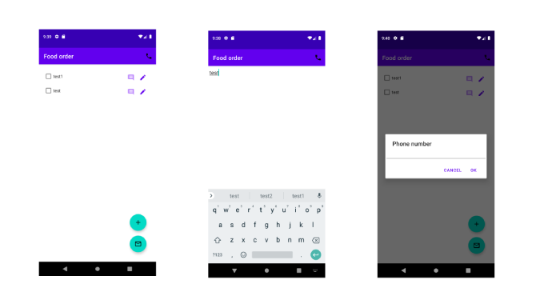

# Приложение "Список товаров"

## Описание функционала
Приложение позволяет создавать список каких-либо вещей, отмечать необходимые и отправлять их в sms-сообщении.
Список может редактироваться, наиболее часто выбираемые элементы списка поднимаются вверх по списку.
Номер телефона для отправки sms-сообщений также редактируется.

## Техническое описание
Приложение написано на языке Kotlin, построено в соответствии с паттерном MVVM. Для операций с БД используется Room,